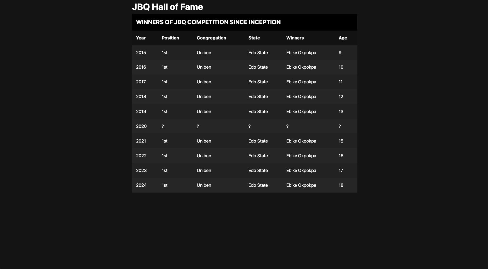

# Building A Responsive Table Using HTML5 and CSS3

Tables by default come as desktop-first components. The only approach available is to treat it as it comes. Make it look good on the desktop and then go ahead to make it responsive on smaller devices.

Most times, after creating a table, it looks jumbled and mumbled up on the screen.

---

On the desktop, a typical table looks like this: 

---

A table that is not responsive looks like this: 

---

A very neat responsive table looks like this: 

You'd notice from the above picture that html5 tries to handle responsiveness of the table but it's implementation of responsiceness here is poor and ugly.

You can see the scroll bars that came up to take care of the overflow cases. This is pretty ugly and not convenient for users.

Some of the most important codes to pay attention to are:

1. HTML tags

```html
<table></table>

<caption></caption>

<tr></tr>

<th></th>

<td></td>

<td data-cell="Year">2015</td>
```

2. CSS

```css
@media (max-width: 650px) {
}

td::before {
  content: attr(data-cell) ": ";
}
```

This is a simple practice project I am worked on using Kelvin Powell's video on youtube.

copyright: **(c) philemon okpokpa 2023**

Author: [sirphilalx](https://www.github.com/sirphilalx, "Philemon Okpokp")
